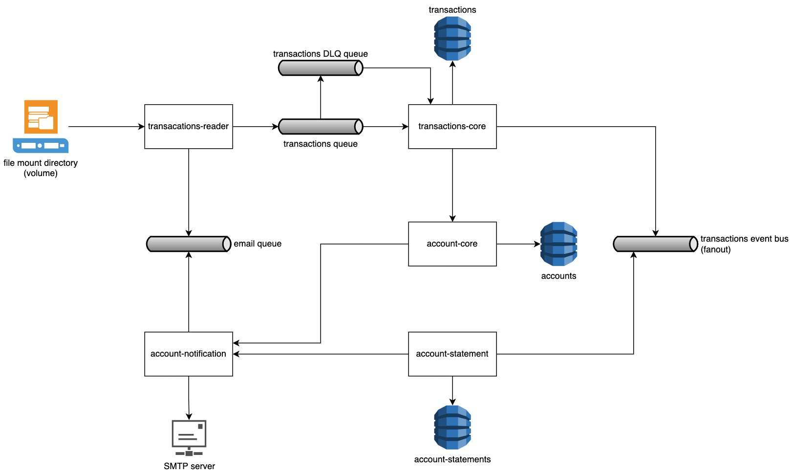

# Stori challennge

## A little beginning ##

>If at first you don't succeed, call it version 1.0 __~ Erick Barrera__

### Author ###
* Erick Barrera - **ebarreral.isc@gmail.com**

## Table of contents

* [Technology stack](#technology-stack)
* [Requirements](#requirements)
* [Proposal architecture](#proposal-architecture)
* [Transactions reader documentation](transactions-reader/README.md)
* [How to run the application](#how-to-run-the-application)
	- [Please read this section](#please-read-this-section)
    - [Demo video](#demo-video)
* [File format](#file-format)
    - [Assumptions](#assumptions)
* [Considerations](#considerations)
    - [Make clean](#make-clean)
* [Improvements](#improvements)
* [FAQ](#faq)

## Technology stack ##

- Java 11
- Maven
- Spring
- Docker
- DynamoDB
- RabbitMQ

## Requirements ##

- Operating System based on UNIX
- Docker
- AWS CLI

## Proposal architecture ##



## How to run the application ##

To run the entire system correctly, you will need to use __two terminals__.

In the first terminal you must follow the following instructions:

1. run `make services` (this may take a few minutes the first time, as it will create the necessary images for its execution)

>__NOTE:__ The services will be ready for execution when in the first terminal you see the message: *"Started XApplication in Y seconds (JVM running for ..)"*

In the second terminal you must follow the following instructions:

1. run `make tables` (this will create the dynamo tables the system requires)
2. run `make app` (it will be the initial application of the system, where the system will do the actions that the user enters)

>__NOTE:__ It's important that you read the instructions for the second terminal (interactive menu), as you must enter the correct data for its correct use.


### Please read this section ###
👉🏽 👉🏽 👉🏽 👉🏽 👉🏽 👉🏽 👉🏽 __README pls!!!__ 👈🏽 👈🏽 👈🏽 👈🏽 👈🏽 👈🏽 👈🏽 

In the second terminal ("make app") you have 3 options:

1. Read CSV file

In this process, as a first step, you will be asked for the email where the transaction reading report will be sent.

The second step will be to include the path where the file is located, being dockerized and running in a container, the image was created to create an anchor volume on the root where this project is located and __you must type the name of the internal volume + the file name__.

Ex.

```shell
/file-repository/transacciones-chidas.csv
or
/file-repository/transacciones-fantasma.csv
```

In your folder, where you have cloned this repository, a temporary `/tmp/transactions` folder will be created and it is in this folder that you should place your files from your local computer.

Ex.

```shell
/Users/mago-justiciero/stori-challenge/tmp/transactions/transacciones-chidas.csv
or
/Users/mago-justiciero/stori-challenge/tmp/transactions/transacciones-fantasma.csv
```

The above is managed by the __*Makefile*__ and by the clause that has `$(shell pwd)/tmp/transactions:/file-repository`.

You can change the first parameter, but not the second (__file-repository__) since it was created from the base of the image

__If the file has been executed correctly you will see the following message__

```shell
Reading filepath [/file-repository/1.csv]
 \m/. File was read successfully!!!
Sending transactions in batch, you can continue executing commands :D
```

> __NOTE:__ the mail will be scheduled to be sent in __*2 MINUTES*__ once the execution of the file reading is finished, if it does not arrive in the first terminal the error will appear, possibly it is a typo, or failing that, some connection, or a process that has died unexpectedly (hopefully it does not happen) in any of the cases feel comfortable requesting help by email and I will gladly help.

2. Send email

The first step in this process is to request the email where the account statement will be sent, the second parameter is the account number and the third parameter is the year of the account statement. Note that these parameters have no validations ("I know! It can be frustrating, but I spent the time developing an architecture-based system")

If the requested information (account and year) exists, the mail will be queued and an attempt will be made to send it immediately, if no mail arrives, the error log can be seen in the first terminal, possibly the year does not contain information, or otherwise, the account does not exist.

3. End application

This will simply kill the process of the second terminal ("make app")

☝🏽 [Return to table of contents](#table-of-contents)

## File format ##

The file format must contain the following structure:

1. the first row must be the header, in the following order: `id,transaction,account,date`
2. the following rows must have the information in the same order

Ex.

```csv
id,transaction,account,date
201,+1,19,2027-01-18T15:33:12.421Z
202,+2,19,2027-02-18T15:33:12.421Z
203,+3,19,2027-03-11T15:33:12.421Z
204,4,19,2027-04-18T15:33:12.421Z
205,5,19,2027-05-18T15:33:12.421Z
206,6,19,2027-06-19T15:33:12.421Z
207,+7,19,2027-07-18T15:33:12.421Z
208,+8,19,2027-08-18T15:33:12.421Z
209,+9,19,2027-09-18T15:33:12.421Z
210,+10,19,2027-10-18T15:33:12.421Z
211,+11,19,2027-11-18T15:33:12.421Z
212,+12,19,2027-12-18T15:33:12.421Z
```

☝🏽 [Return to table of contents](#table-of-contents)

### Assumptions ###

- The account must be the same,
- The id must be numeric without decimals
- The date must have the standard format ([ISO 8601](https://www.w3.org/TR/NOTE-datetime)) with time zone yyyy-MM-dd'T'HH:mm:ss'Z'
- The data must be separated by commas and without single or double quotes
- The date has no restriction, as long as the account is the same the system will detect the years/months of each transaction and will group the account statements and these will be sent after two minutes

## Considerations ##

You can terminate and execute the `make app` command as many times as you like, but if the first terminal (`make services`) is destroyed or terminates its process with CTRL+C you will have to start the process again.

### Make clean ###

It will only work in the second terminal ("make app") since it needs the first terminal to keep running due to the fact that dynamo is managed by *"docker-compose"* and this command will delete all created resources, only if they've executed the previous steps correctly in any other case will generate an error.

## Improvements ##

It can be detected that the system has many improvements in terms of validations, I know it seems easy, but personally, I focus this challenge more on architectural and distributed design. Once uploaded I will add more validations.

Here I will leave a list of what I consider to be missing or that has areas for improvement:

- Add common/basic validations
- Add unit testing
- Add integration testing
- Add failover handling
- Add cache
- Optimize search with elastic
- Optimize event bus with event bridge
- Change SMTP server to CMS or CRM
- Mount on cloud
- Optimize communication to RPC instead of REST
- Add monitoring

☝🏽 [Return to table of contents](#table-of-contents)

## FAQ ##

I'm getting this error `docker: Error response from daemon: Conflict. The container name "/transactions-reader" is already in use by container`, how can I solve it?

*R: To solve this, you need to execute the following commands*

```shell
make force-destroy-app
make app
```
---

I'm not getting the email when I chose the path option, how can I solve it?

*R: If the first terminal, doesn't show you what's the error, you need to validate if you didn't close the second terminal ("make app"), the transactions-reader module creates a scheduler to send the email after two minutes when the file was processed successfully and if you close or kill that process the email will not be scheduled, in that case, you need to run the `make app` command again but now choose the second option.*

---

I'm getting this message:

```txt
./scripts/wait-for.sh localhost:8000 -t 60 -- ./delete-tables.sh
wait-for.sh: waiting 60 seconds for localhost:8000
wait-for.sh: timeout occurred after waiting 60 seconds for localhost:8000

Could not connect to the endpoint URL: "http://localhost:8000/"

Could not connect to the endpoint URL: "http://localhost:8000/"

Could not connect to the endpoint URL: "http://localhost:8000/"
make: *** [clean] Error 255
```

how can I solve it?

*R: Maybe you closed the terminal's service ("make services"), since dynamo service was orchestrated with the docker-compose file, you need to delete manually with:*

```shell
make force-destroy
```

And execute the same steps from the section [How to run the application](#how-to-run-the-application)

---

I'm getting this message:

```txt
./scripts/wait-for.sh localhost:8000 -t 60 -- ./init-tables.sh
wait-for.sh: waiting 60 seconds for localhost:8000
wait-for.sh: localhost:8000 is available after 0 seconds

An error occurred (ResourceInUseException) when calling the CreateTable operation: Cannot create preexisting table

An error occurred (ResourceInUseException) when calling the CreateTable operation: Cannot create preexisting table

An error occurred (ResourceInUseException) when calling the CreateTable operation: Cannot create preexisting table
make: *** [tables] Error 254
```

how can I solve it?

*R: You already have the tables created, you can execute directly the app `make app`* 

---

😵 Some doubts or some issues? Please contact me to `ebarreral.isc@gmail.com`
