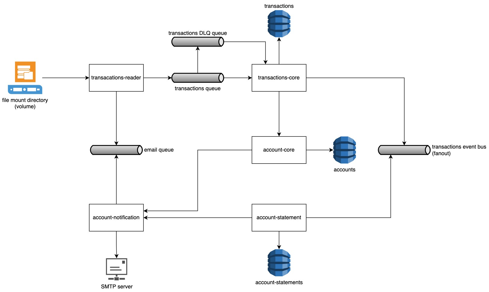

# Stori challennge

### A little beginning ####

>If at first you don't succeed, call it version 1.0 __~ Erick Barrera__

#### Author ####
* Erick Barrera - **ebarreral.isc@gmail.com**

### Technology stack ###

- Java 11
- Maven
- Spring
- Docker
- DynamoDB
- RabbitMQ

### Requirements

- Operating System based on UNIX
- Docker
- AWS CLI

### Proposal architecture

### How to run the application? ###

To run the entire system correctly, you will need to use __two terminals__.

In the first terminal you must follow the following instructions:

1. run `make services` (this may take a few minutes the first time, as it will create the necessary images for its execution)
2. run `make tables` (this will create the dynamo tables the system requires)

In the second terminal you must follow the following instructions:

1. run `make app` (it will be the initial application of the system, where the system will do the actions that the user enters)

>__NOTE:__ It's important that you read the instructions for the second terminal (interactive menu), as you must enter the correct data for its correct use.

### Considerations

