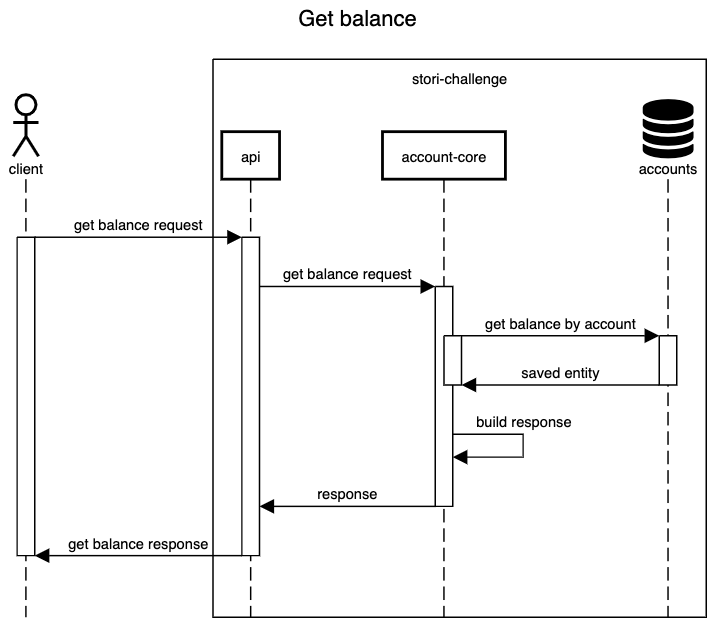
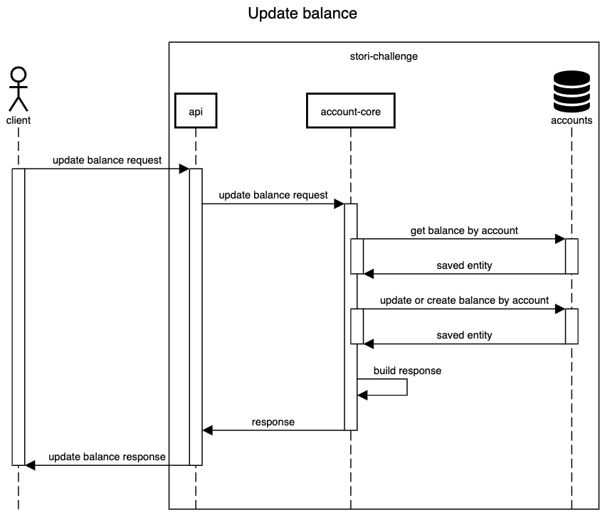

# account-core

This service has the only task to update the balance and get it.

## Table of contents

* [Get balance](#get-balance)
    - [Sequence diagram get balance](#sequence-diagram-get-balance)
* [Update balance](#update-balance)
    - [Sequence diagram update balance](#sequence-diagram-update-balance)

## Get balance
URI `GET /accounts/{account_id}/balance`

Response status | Objetive
--- | ---
`200` | Get the current balance giving the account
`400` | Bad request, the account id hasn't a correct format
`404` | Not found, the account wasn't found
`500` | Internal server error, some flow wasn't handled by the system
`503` | Service unavailable, the dynamodb connection is corrupted


Response for `200 OK`

```json
{
    "id": 18,
    "balance": 64.59
}
```

### Sequence diagram get balance



## Update balance

URI `PUT /accounts/{account_id}/balance`

Response status | Objetive
--- | ---
`202` | Accepted, the request was applied successfully
`400` | Bad request, the account id hasn't a correct format
`404` | Not found, the account wasn't found
`500` | Internal server error, some flow wasn't handled by the system
`503` | Service unavailable, the dynamodb connection is corrupted

Request payload

```json
{
    "amount": 89.48
}
```

### Sequence diagram update balance



☝🏽 [Return to main documentation](../README.md#table-of-contents)