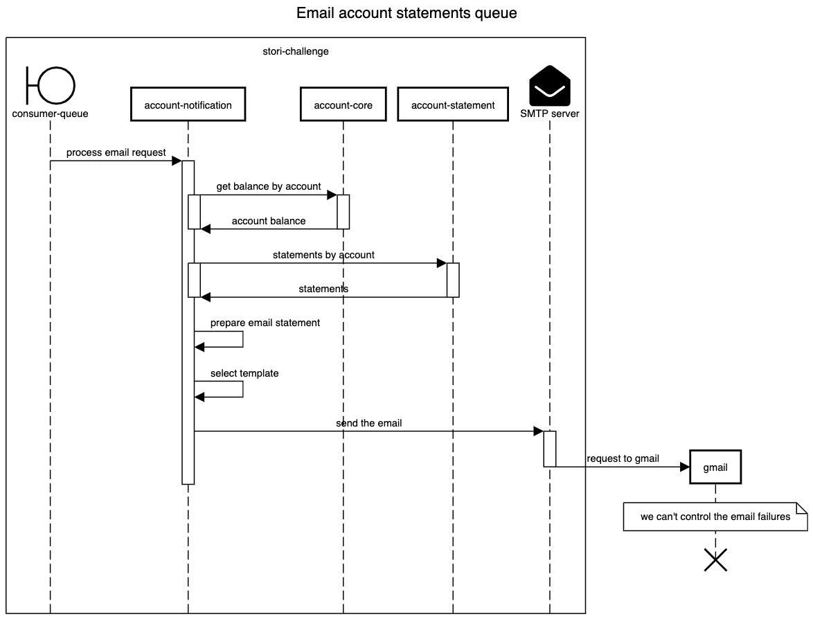

# account-notification

This service has the only task to get the information to send an email with the statements.

## Table of contents

* [Request email account statements](#request-email-account-statements)
    - [Sequence diagram request email account statements](#sequence-diagram-request-email-account-statments)
* [Email account statements queue](#email-account-statements-queue)
    - [Sequence diagram email account statements queue](#sequence-email-account-statements-queue)

## Request email account statements
URI `POST /emails/statement`

Response status | Objetive
--- | ---
`200` | A success response and queue the email request
`400` | Bad request, the account id hasn't a correct format
`404` | Not found, the account wasn't found
`500` | Internal server error, some flow wasn't handled by the system
`503` | Service unavailable, the dynamodb connection is corrupted

Request payload

```json
{
    "to_email": "ebarreral.isc@gmail.com",
    "account_id": 18,
    "year": 2027
}
```

Response for `200 OK`

```json
{
    "message": "Email queued"
}
```

### Sequence diagram request email account statements


## Email account statements queue

This consumer recive a json request from this queue `demo.stori.notification.account.statement`

Request json

```json
{
    "to_email": "ebarreral.isc@gmail.com",
    "account_id": 18,
    "year": 2027
}
```

### Sequence diagram email account statements queue



☝🏽 [Return to main documentation](../README.md#table-of-contents)