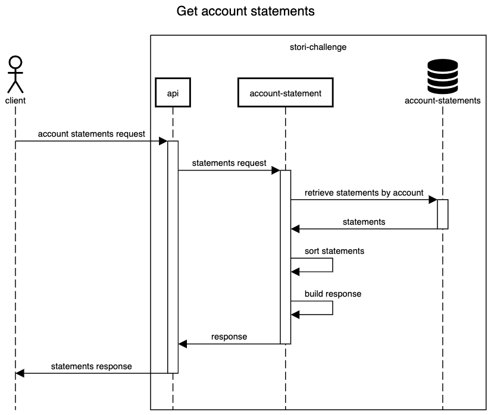
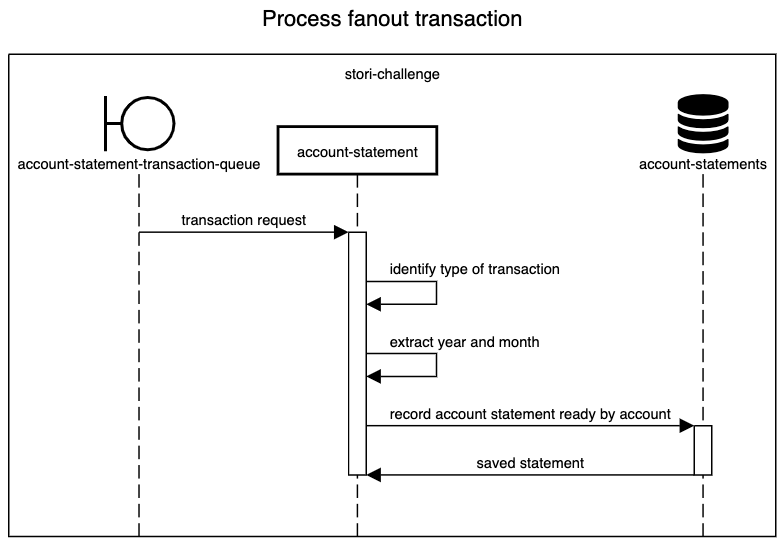

# account-statement

This service will be in charge of grouping the transactions by year and month for each account, and consolidating the monthly account statement by account.

## Table of contents

* [Get account statements](#get-account-statements)
    - [Sequence diagram get account statements](#sequence-diagram-get-account-statements)
* [Process fanout transaction](#process-fanout-transaction)
    - [Sequence diagram process fanout transaction](#sequence-email-process-fanout-transaction)

## Get account statements
URI `GET /account-statements/{account_id}`

Request parameters | Required | Default value | Objetive
--- | --- | --- | ---
`year` | no | current year | The year to get the statement information

Response status | Objetive
--- | ---
`200` | The list of account statements grouped by month
`400` | Bad request, the request hasn't a correct format
`404` | Not found, the account wasn't found
`500` | Internal server error, some flow wasn't handled by the system
`503` | Service unavailable, the dynamodb connection is corrupted

Request example:

`GET /account-statements/18?year=2027`


Response for `200 OK`

```json
[
    {
        "month": "January",
        "account_id": 18,
        "debit": 18.82,
        "credit": 89.12,
        "transactions": 789
    },
    {
        "month": "April",
        "account_id": 18,
        "debit": -1.22,
        "credit": 199.32,
        "transactions": 789
    }
]
```

### Sequence diagram get account statements




## Process fanout transaction

This consumer recive a json request from this queue `demo.stori.account.statement.transaction.new`

Request json

```json
{
    "id": 111, // Transaction id
    "transaction": "+18.12", // transaction to debit or credit
    "date": "2027-05-23T12:04:12.561Z", // transaction date
    "origin": "FILE", // origin from the transaction FILE or API
    "reference": "file-reference-checksum" // calculated checksum from file for transactions logs
}
```

### Sequence diagram process fanout transaction



☝🏽 [Return to main documentation](../README.md#table-of-contents)