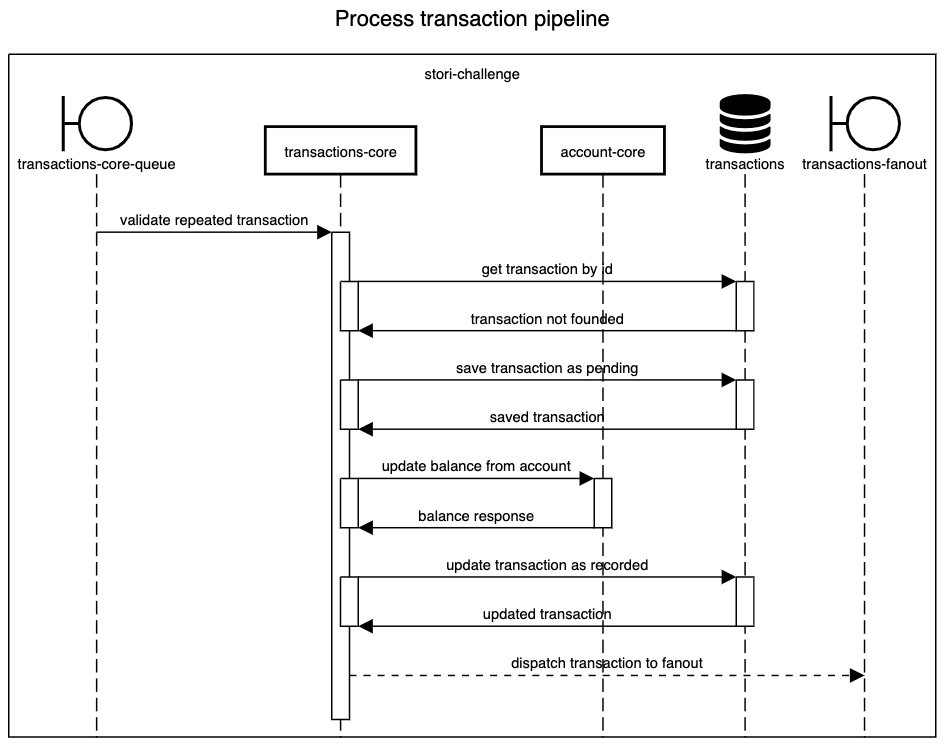

# transactions-core

This service will be in charge of reading each transaction through a message queue, it will go through a pipeline to determine if the transaction can be executed.

## Process transaction pipeline

This consumer recive a json request from this queue `demo.stori.core.transaction.new`

Request json

```json
{
    "id": 111, // Transaction id
    "transaction": "+18.12", // transaction to debit or credit
    "date": "2027-05-23T12:04:12.561Z", // transaction date
    "origin": "FILE", // origin from the transaction FILE or API
    "reference": "file-reference-checksum" // calculated checksum from file for transactions logs
}
```


### Sequence diagram process transaction pipeline




☝🏽 [Return to main documentation](../README.md#table-of-contents)