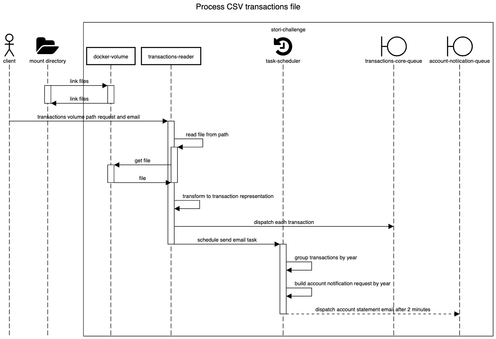
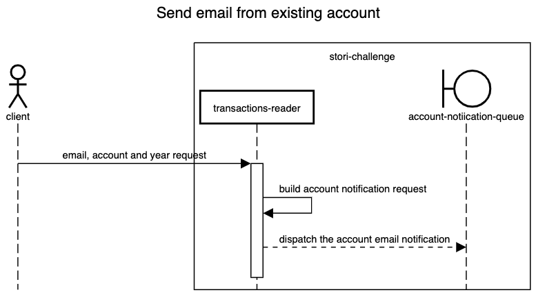

# transactions-reader

This service will be in charge of maintaining the interaction with the user and the data entry.

## Process CSV transactions file

When interacting with the application by selecting the process path option, the first data that will be requested is the email where the generated account statements will be sent, if everything is done correctly. It is important to read the main [README](https://github.com/erbalo/stori-challenge/blob/master/README.md#please-read-this-section) of the project for its correct operation.

### Sequence diagram process CSV transactions file

## Send email from existing account

When interacting with the application by selecting the option to send an email, the data that will be requested will be the email where the mail will arrive with the account statement, the account id, and the year of the account statement, this request will be queued to the system suitable for sending emails. It is important to read the main [README](https://github.com/erbalo/stori-challenge/blob/master/README.md#please-read-this-section) of the project for its correct operation.

### Sequence diagram send email from existing account

